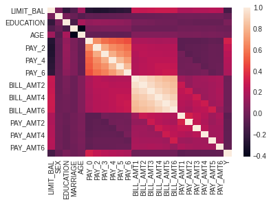
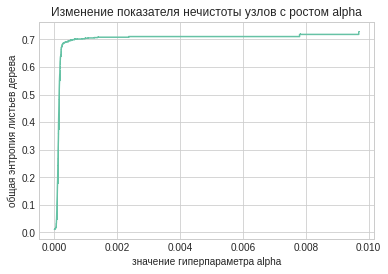
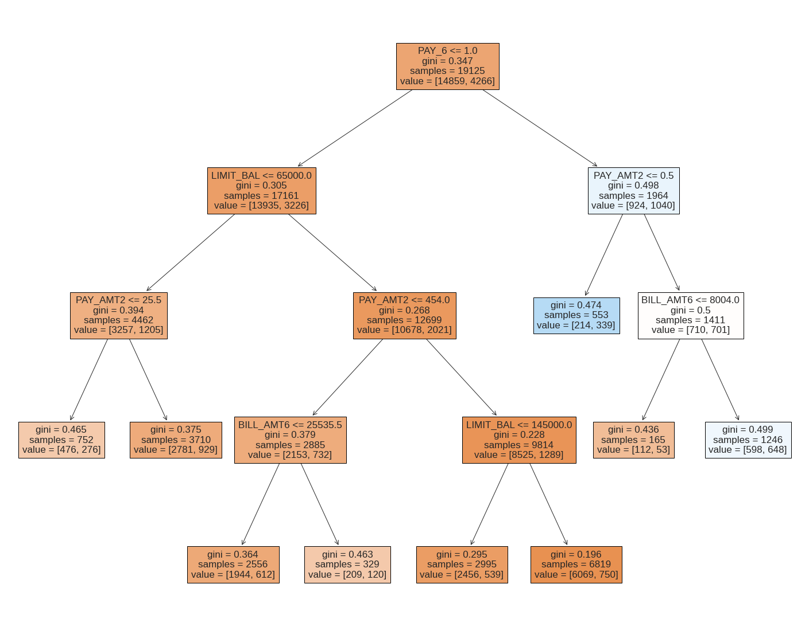
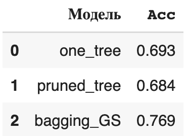
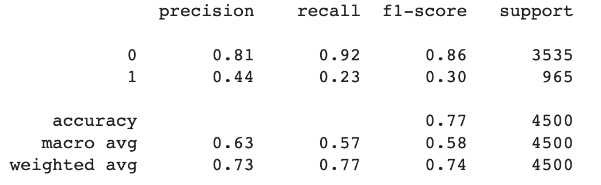

`Дисциплина: Методы и технологии машинного обучения`   
`Уровень подготовки: бакалавриат`   
`Направление подготовки: 01.03.02 Прикладная математика и информатика`   
`Семестр: осень 2022/2023`  

# Лабораторная работа №5: Методы, основанные на деревьях решений. Регрессионные деревья. Деревья классификации. Бэггинг.  

В практических примерах ниже показано:   

* как делать перекодировку признаков в номинальной и порядковой шкалах
* как вырастить дерево и сделать обрезку его ветвей   
* как настроить модель бэггинга   
* как подбирать настроечные параметры моделей методом сеточного поиска  

Точность модели оценивается методом перекрёстной проверки по 5 блокам.  

Данные были взяты из прошлой лабораторной работы по регуляризации регрессии:
https://raw.githubusercontent.com/ania607/ML/main/data/default_of_credit_card_clients.csv

По корреляционной таблице, представленной ниже, мы отобрали признаки UMITBAL, SEX, EDUCATION, MARRIAGE, AGE, PAY_6, BILL_AMT6, PAY_AMT2

Далее была проведена перекодировка номинальной и порядковой шкалы и построение дерева с обрезкой ветвей.

Пример дерева с 17 узлами:

Делее мы воспользуемся алгоритмом бэггинга. Перебрам 5 различных значений B ([10, 20, 30, 40, 50]), лучшим оказалось 40

Сравним точность построенных моделей

Все модели показывают среднюю точность по показателю  𝐴𝑐𝑐 , при этом самой точной оказывается модель бэггинга. Сделаем прогноз на отложенные наблюдения.

Сравним точность на отложенных наблюдениях с точностью моделей из упражнения 4. 

| | precision | recall | f1-score | support |
| :---: |     :---:      | :---: | :---: | :---: |
| 0 | 0.82 | 0.97 | 0.89 | 3535 |
| 1 | 0.70 | 0.24 | 0.36 | 965 |
| accuracy | | | 0.82 | 4500 |
| macro avg|  0.76  | 0.61  | 0.62  | 4500 |
| weighted avg | 0.80 | 0.82 | 0.78 | 4500 |

| | Модель | Acc |
| :---: | :---:| :---:|
| 0 | logit_PLS	 |  0.796 |
| 1 | logit_lasso | 0.810 | |

Точность моделей из упражнения 4(то есть из прошлой лабы) оказалась лучше.

