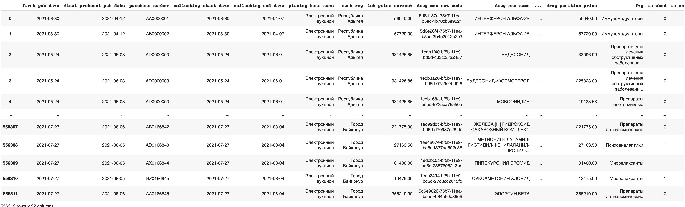
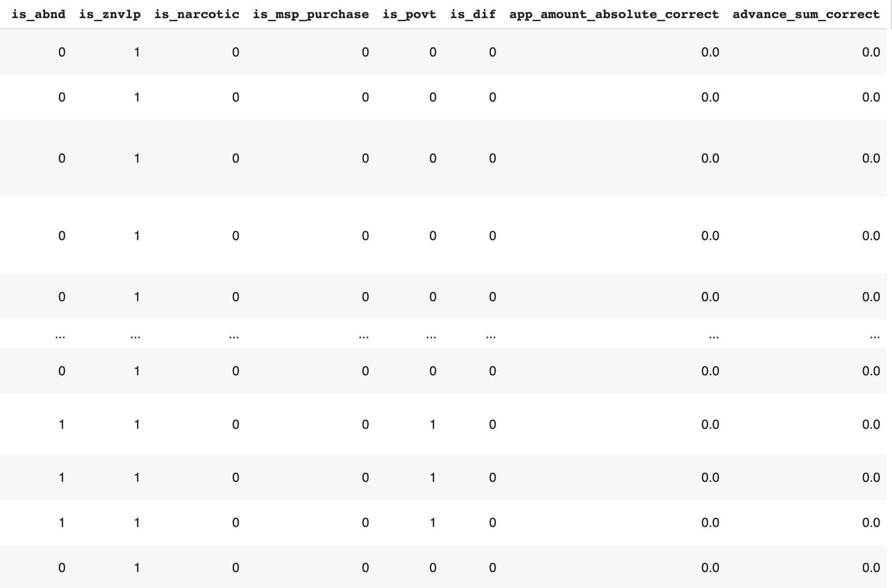
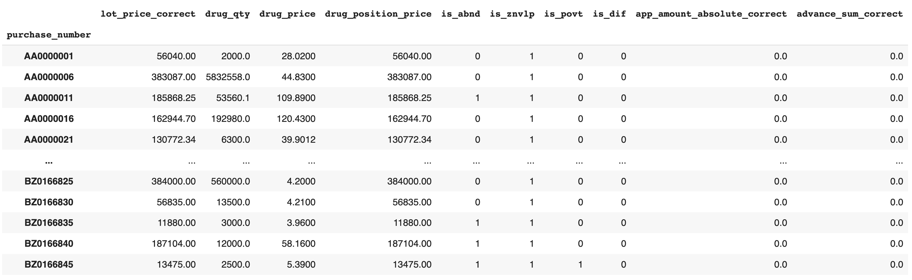
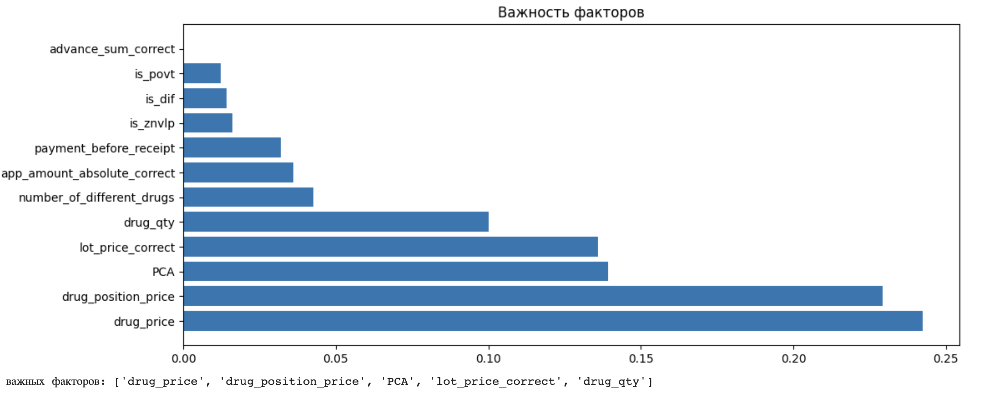

# Лабораторная работа №2. Исследование факторов и организация работы с таблицами данных

Набор данных: data_purch.xlsx.

Выполнила студентка 3 курса ПМИ 3-1 Пашнина А.К.

###### Загрузка данных

*Часть датафрейма*

######  Описание полей:

* first_pub_date – дата публикации процедуры
* final_protocol_pub_date – дата завершения процедуры
* purchase_number – идентификатор процедуры
* collecting_start_date – дата начала сбора заявок от потенциальных поставщиков
* collecting_end_date – дата окончания сбора заявок от потенциальных поставщиков
* placing_base_name – форма проведения торгов (конкурс, аукцион и т.п.)
* cust_reg – регион заказчика процедуры
* lot_price_correct – максимально возможная, объявленная заказчиком, цена за все препараты в закупке
* drug_mnn_ext_code – идентификатор лекарственного препарата
* drug_mnn_name – наименование лекарственного препарата (их меньше, чем drug_mnn_ext_code)
* drug_qty – объем закупаемого лекарственного препарата
* drug_price – цена за единицу объема закупаемого лекарственного препарата
* drug_position_price – цена за всю позицию закупаемого лекарственного препарата
* ftg – класс закупаемого лекарственного препарата
* is_abnd – фиктивная переменная: 1 – закупка не состоялась, 0 – состоялась
* is_znvlp – фиктивная переменная: 1 – в закупке содержится хотя бы 1 препарат из списка ЖВЛП, 0 – не содержатся
* is_narcotic – фиктивная переменная: 1 – в закупке содержится хотя бы 1 препарат, в составе которого есть наркотические вещества, 0 – не содержатся
* is_msp_purchase – фиктивная переменная: 1 – закупка предназначена только для субъектов малого и среднего предпринимательства, 0 – не предназначена
* is_povt – фиктивная переменная: 1 – эту процедуру заказчик вынужден повторить, 0 – не повторная
* is_dif – фиктивная переменная: 1 – в закупке содержится хотя бы 1 препарат, являющийся дефицитным, 0 – не содержатся
* app_amount_absolute_correct – сумма залога
* advance_sum_correct – сумма аванса

Предположительно из имеющихся показателей на вероятность незакрытия закупки сильнее всего влияют:

- `lot_price_correct`: максимально возможная, объявленная заказчиком, цена за все препараты в закупке
- `drug_qty`: объём закупаемого лекарственного препарата
- `drug_price`: цена за единицу объема закупаемого лекарственного препарата
- `drug_position_price`: цена за всю позицию закупаемого лекарственного препарата
- `is_znvlp`: содержится ли препарат в списке ЖВЛП
- `is_narcotic` – есть ли в составе наркотические вещества
- `is_msp_purchase` – предназначена ли закупка только для субъектов малого и среднего предпринимательства
- `is_dif` – есть ли в закупке хотя бы 1 препарат, являющийся дефицитным
- `app_amount_absolute_correct` – сумма залога
- `advance_sum_correct` – сумма аванса

#### Группировка

### Формирование новых факторов

##### Фактор, полученный с помощью метода главных компонент:
- `PCA` - фактор полученный при помощи метода главных компонент по 1-ой компоненте.

##### Факторы, полученные с помощью замен и арифметических операций:
- `number_of_drugs` - количество препаратов в закупке.
- Сумма аванса и залога (`advance_sum_correct` + `app_amount_absolute_correct`).

### Разделение на обучающую и тестовую выборку

За целевую переменную берём *is_abnd*

#### Оценка важности факторов на основе метода "Дерево решений" 

#### Построение модели логистической регрессии

Точность модели на обучающей выборке: 0.5070370370370371

Точность модели на тестовой выборке: 0.5006060606060606

Точность около 0.5 означает, что модель правильно соотносит 50% объектов. Это практически случайное угадывание. Таким образом, точность является низкой и указывает на то, что модель не может точно предсказывать целевую переменную. Модель не пригодна для использования
