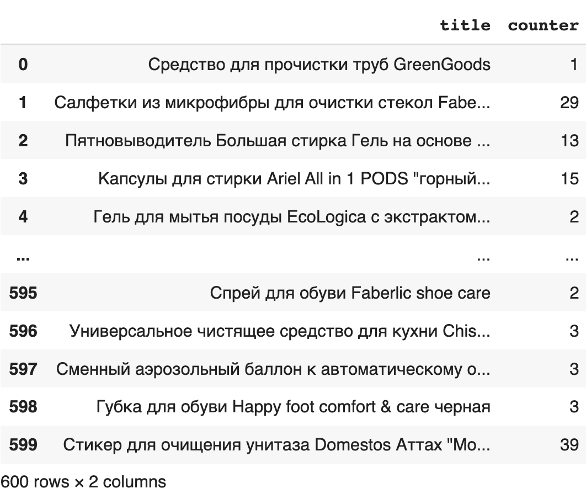
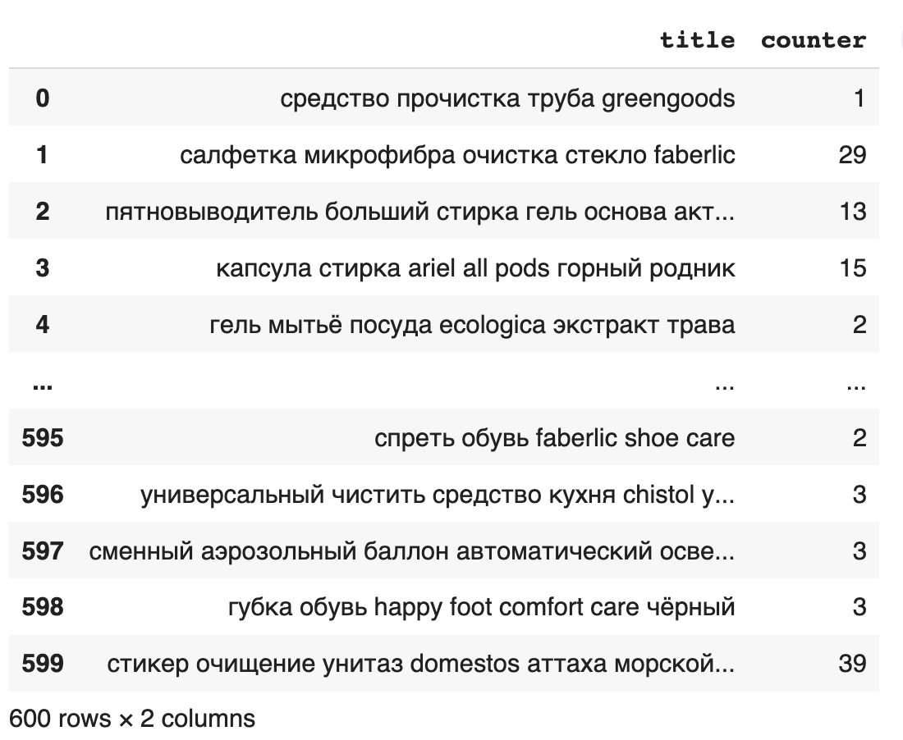
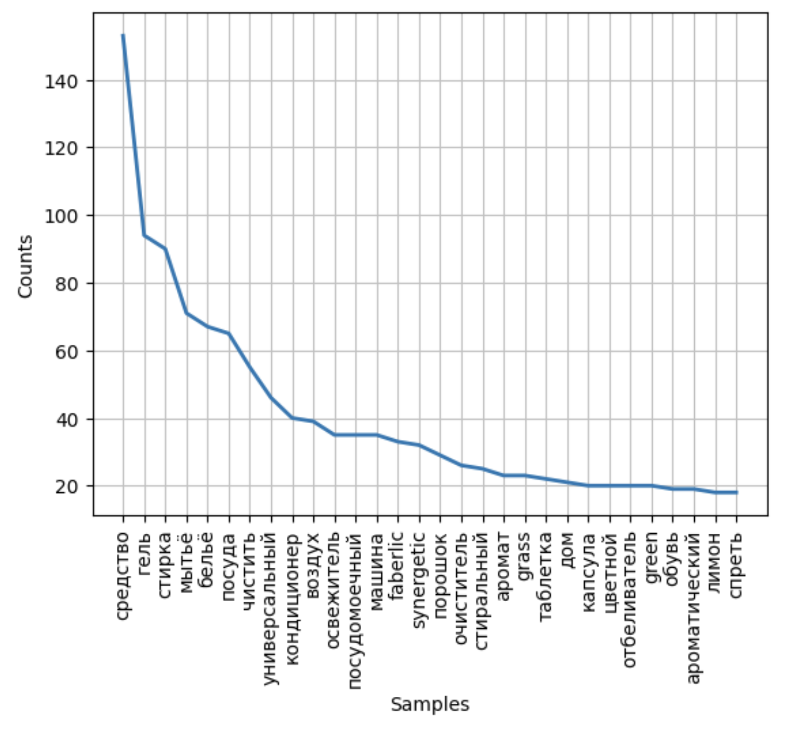
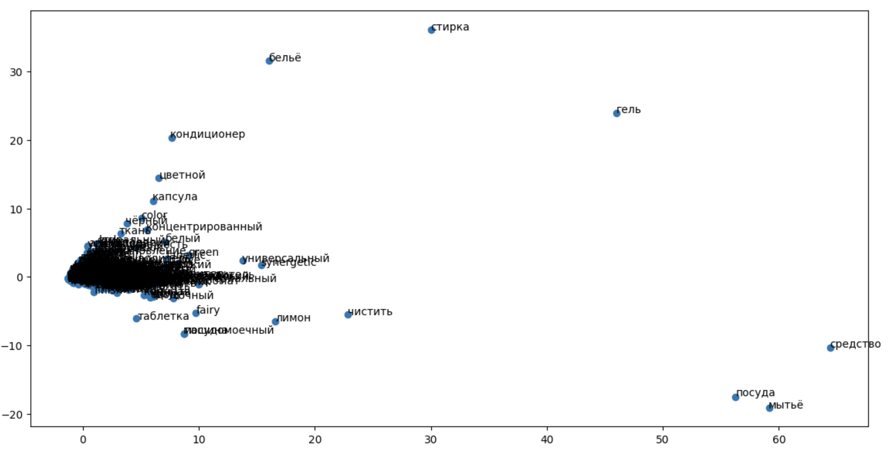
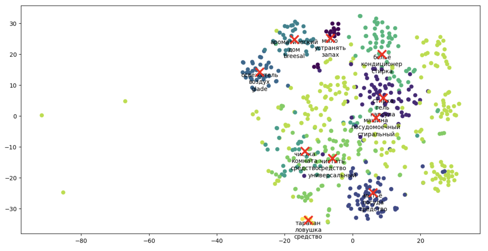
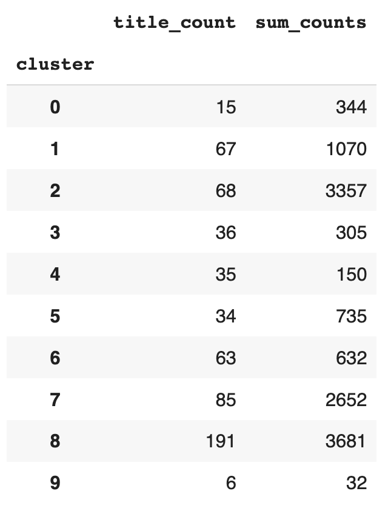

# Парсинг сайтов и анализ текстовой информации
Данные: `irecommend.ru/catalog/list/3769`

## Загрузка модулей и считывание файла

Можно заметить насколько часто используется предлог "для" в названиях товаров. 
Необходимо привести данные к нижнему регистру, почистить от стоп-слов, знаков препинания, одиночных чисел и символов, а также привести к нормальной форме.

## Разведочный анализ данных и их корректировка

Нам удалось обработать текст и выделить наиболее часто встречающиеся темы, которые относятся к бытовой химии. 

Частотный анализ слов:

Скорее всего, разделение может быть произведено по:

* Средства для стирки
* Средства для мытья посуды
* Очистители
* Освежители воздуха
* Средства для ухода за бельем
* Кондиционеры для белья
* Бренды
* Стиральные машины
* Также все пункты могут быть объединены в одну категорию "Бытовая химия".

## Сравнение алгоритмов TfidVectorizer и CountVectorizer

TfidfVectorizer в большинстве случаях всегда будет давать более хорошие результаты, так как он учитывает не только частоту слов, но и их важность в тексте. Примерные его группы разбиения:

1) Мыла (разные)

2) Всё для стирки

3) Всё для мыться посуды

4) Освежитель воздуха

5) Ароматизаторы

6) Средства для мытья стекол и сантехники

7) Товары для стирки

8) Видимо сюда попало все остальное

9) И сюда

10) Для травки тараканов

Хотя CountVectorizer показал результаты не сильно хуже:

1) Тут всего 1 группа - клейкие ленты

2) Стиральные порошки

3) Всё для кухни

4) Всё для стирки

5) Видимо сюда попало все остальное

6) Очистка сантехники

7) Очистка сантехники

8) Кондиционеры для белья

9) Освежитель воздуха

10) Мытье стекол и посуды

Провизуализируем разбиение алгоритмами:

* Метод главных компонент

* Tf-idf и t-SNE

### Подсчёт характеристик

### Вывод
Исходя из таблицы, можно сделать вывод, что товары из 2-го и 8-го кластера, связанные со средствами для стирки, наиболее популярны и пользуются наибольшей популярностью среди пользователей. Кластеры 1 (мыло) и 7 (средства для мытья сантехники и стирки) также имеют довольно большое количество отзывов, что свидетельствует о высоком спросе на товары данных категорий. Кластеры 5 (ароматизаторы) и 6 (чистка сантехники) имеют меньшее количество отзывов, что может говорить о более узкой аудитории потребителей. Остальные кластеры имеют еще меньшее количество отзывов, что может говорить о том, что данные товары пользуются меньшей популярностью или имеют более узкую целевую аудиторию.
