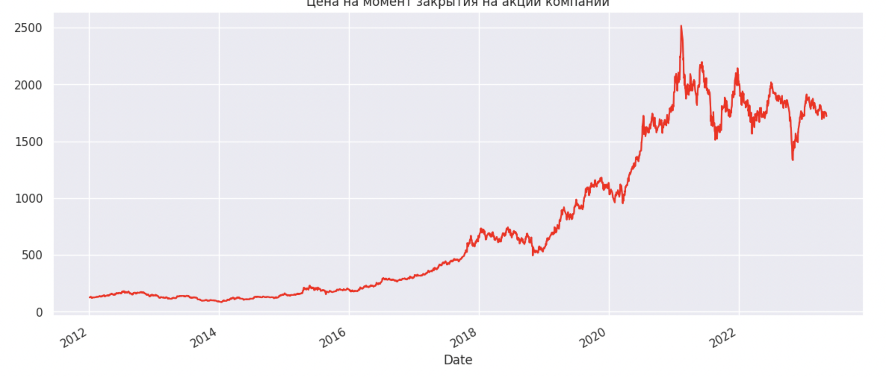

`Дисциплина: Методы и технологии машинного обучения`   
`Уровень подготовки: бакалавриат`   
`Направление подготовки: 01.03.02 Прикладная математика и информатика`   

# Работа с временным рядом

### Работу выполнила Пашнина Алёна, вариант 14

#### Набор исходных данных:

Нам нужны только данные о дате и цене закрытия:

#### График временного ряда:

График показывает, что цены на акции были в основном стабильны в начале периода. Однако, можно заметить, что существует большое количество короткосрочных колебаний цен, которые не подчиняются общему тренду и вызваны внешними факторами.

На графике цен на момент закрытия акций, представленном выше, можно наблюдать общий тренд цен на протяжении всего периода.

#### Результаты теста Дикки-Фуллера на стационарность

Проверим на уровне значимости 0.05

На основании теста Dickey-Fuller, можно сделать вывод о том, что временной ряд не является стационарным. Это подтверждается большим значением p-value, превышающим уровень значимости 0.05, а также недостаточным значением тестовой статистики для отклонения от нулевой гипотезы о нестационарности ряда.

#### Методология Бокса-Дженкинса

График ACF:

График PACF:

Это означает, что на 270-м лаге автокорреляционная функция (ACF) последующие лаги становятся значимыми. Из графика PACF можно сделать вывод, что после 2-го лага все последующие лаги не являются значимыми, т.е. корреляция становится незначительной.

Результаты построение PACF и ACF не удовлетворительны. Сложно определить примерные значения p,q для построения ARIMA-модели. Предлагается для начала избавится от трендовой зависимости.

### Удалениe линейной трендовой составляющей из временного ряда

#### Тест Дикки-Фуллера без тренда

Хоть ряд и не является стационарным, результаты теста Дики-Фуллера показывают, что значение p-value уменьшилось. Это может свидетельствовать о том, что ряд стал более стационарным, чем раньше.

### Методология Бокса-Дженкинса без тренда

ACF:

PACF:

Мы смогли снизить зависимость цены акции от предыдущих значений, однако она все еще остается существенной.

### Разделим данные

Размеры:

- На преобразованных данных можно построить модель ARIMA(7,0,6)

- На исходных данных можно построить модель ARIMA(7,2,9)

#### Проверим модель на тестовой выборке

- Средняя абсолютная ошибка равна 1.481

#### Прогноз на 10 шагов вперед:

Исходя из анализа графика, можно сделать вывод, что в будущем цены на акции компании скорее всего не будут повышаться.

### Построение моделей для прогноза по разным периодам

Требуется разделить исходные данные на 3 блока Предлагается взять такие интервалы:

- До 2016-06-01

- 2016-06-01 - 2020-01-01

- 2020-01-01 - н.в.

Далее все 3 выборки делим на train и test.

- Best model on 1 block: (3, 0, 5) на train: 2.132146596651886 на test: 2.7488671533761857

- Best model on 2 block: (4, 1, 7) MAE on train: 8.131265391358152 MAE on test: 18.81789890090917

- Best model on 3 block: (3, 0, 3) на train: 26.47764874372905 на test: 19.47256573584231

Из результатов моделирования видно, что лучшая модель на первом блоке данных имеет порядок (3,0,5) и достигает MAE на тренировочной выборке в размере 2.132, а на тестовой - 2.749.

Лучшая модель на втором блоке данных имеет порядок (4,1,7) и достигает MAE на тренировочной выборке в размере 8.131, а на тестовой - 18.817.

Лучшая модель на третьем блоке данных имеет порядок (3,0,3) и достигает MAE на тренировочной выборке в размере 26.478, а на тестовой - 19.473.

Модель с наименьшим значением MAE на тестовой выборке является наиболее предпочтительной для прогнозирования будущих значений. Следовательно, на основе результатов моделирования можно сделать вывод, что наиболее точная модель на тестовой выборке была построена на первом блоке данных и имеет порядок (3,0,5).