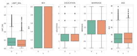
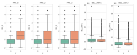
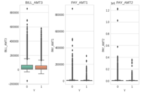
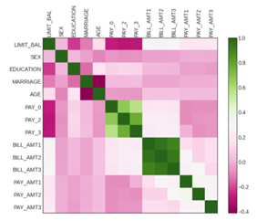
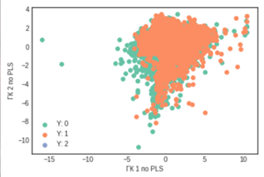
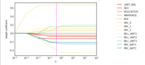

# Лабораторная работа №4: Методы снижения размерности. Регуляризация логистической регрессии.

_Модели_: множественная линейная регрессия

_Данные_: `default_of_credit_card_client` 

_Метод снижения размерности_: **PLS**

_Метод регуляризации_: **лассо\-регрессия**

# Загрузка данных

Загружаем данные и оставляем необходимые переменные. Откладываем 15% наблюдений для прогноза.

# Предварительный анализ данных

Выводы по описательным статистикам: значения объясняющих переменных положительные, масштабы измерения отличаются. Для работы с методами снижения размерности и регуляризации понадобится стандартизация значений.   

Поскольку в наборе данных 9 объясняющих переменных, и все они непрерывные, анализ матричного графика разброса будет затруднительным. Построим коробчатые диаграммы для объясняющих переменных, чтобы сравнить средние уровни и разброс по классам.  

**Визуализация разброса переменных внутри классов**

На графиках отличие в медианах и разбросе между классами прослеживается практически по всем объясняющим переменным. Меньше всего различаются коробчатые диаграммы по переменным pH и residual_sugar. Это говорит о том, классы по зависимой переменной Y неплохо разделяются по всем объясняющим переменным.

**Корреляционный анализ**

Между объясняющими переменными обнаруживаются как прямые, так и обратные линейные взаимосвязи.

# Снижение размерности

**Снижаем размерность методом PLS**

Проводим предварительную стандартизацию переменных и пересчитываем объясняющие показатели в главные переменные

Доли объяснённой дисперсии по компонентам в PLS:
 [0.19  0.109 0.119 0.059 0.073 0.017 0.042 0.023 0.029 0.042 0.008 0.026 0.041] 
Общая сумма долей: 0.778

**Рисуем классы на графике в координатах 2 главных компонент по PLS.**

Судя по графику, классы совсем не разделяются в пространстве двух главных компонент. Построим логистическую регрессию и оценим её точность с помощью перекрёстной проверки.

Модель logit_PLS, перекрёстная проверка по 10 блокам
Acc = 0.8

# Регуляризация модели логистической регрессии

**Лассо-регрессия**

Константы моделей для классов:
 [-1.454] 
Коэффициенты моделей для классов:
 [[-0.13  -0.047 -0.082 -0.073  0.072  0.667  0.106  0.123 -0.449  0.179
   0.164 -0.249 -0.216]]
   
Модель logit_lasso, перекрёстная проверка по 10 блокам
Acc = 0.81

**Изменение коэффициентов ридж-регрессии. Отсечка - оптимальный параметр C**

# Прогноз на отложенные наблюдения по лучшей модели

 Модель	logit_PLS	     0.796
 
 Модель	logit_lasso	   0.810

Так как точность у ридж-регрессии больше, чем у модели со сниженной размерностью, то стоит выбрать данную модель для прогноза на отложенных наблюдениях

| | precision | recall | f1-score | support |
| :---: |     :---:      | :---: | :---: | :---: |
| 0 | 0.82 | 0.97 | 0.89 | 3535 |
| 1 | 0.70 | 0.24 | 0.36 | 965 |
| accuracy | | | 0.82 | 4500 |
| macro avg|  0.76  | 0.61  | 0.62  | 4500 |
| weighted avg | 0.80 | 0.82 | 0.78 | 4500 |

Итак, методом логистической регрессии со сжатием коэффициенты с L1-регуляризацией мы получили идеально точную скоринговую модель по выдаче кредита.
